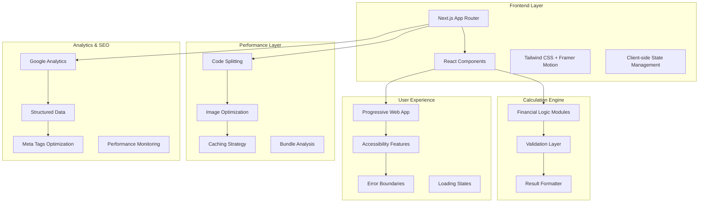

# Design Document: TaiCalc Platform Optimization

## Overview

TaiCalc 平台優化設計旨在提升網站性能、用戶體驗和功能完整性。通過系統性的架構改進、UI/UX 優化和新功能開發，將 TaiCalc 打造成台灣最受歡迎的財務計算工具平台。

## Architecture

### 系統架構圖



### 核心架構原則

1. **性能優先**: 採用 Next.js 15 的最新優化特性
2. **漸進式增強**: 確保基本功能在所有設備上可用
3. **模組化設計**: 計算邏輯與 UI 組件分離
4. **類型安全**: 全面使用 TypeScript 確保代碼品質
5. **可訪問性**: 遵循 WCAG 2.1 AA 標準

## Components and Interfaces

### 1. 性能優化組件

#### Bundle Analyzer
```typescript
interface BundleAnalyzer {
  analyzeBundle(): BundleReport;
  identifyLargeChunks(): ChunkInfo[];
  suggestOptimizations(): OptimizationSuggestion[];
}
```

#### Image Optimization Manager
```typescript
interface ImageOptimizer {
  optimizeImages(images: ImageAsset[]): OptimizedImage[];
  generateResponsiveImages(src: string): ResponsiveImageSet;
  lazyLoadImages(container: HTMLElement): void;
}
```

### 2. 用戶體驗組件

#### Interactive Tutorial System
```typescript
interface TutorialSystem {
  startTutorial(calculatorType: CalculatorType): void;
  showTooltip(element: HTMLElement, content: string): void;
  trackProgress(step: number): void;
  completeTutorial(): void;
}
```

#### Smart Recommendation Engine
```typescript
interface RecommendationEngine {
  analyzeUserBehavior(actions: UserAction[]): UserProfile;
  recommendCalculators(profile: UserProfile): Calculator[];
  suggestRelatedTools(currentTool: string): Calculator[];
}
```

### 3. 增強計算器組件

#### Enhanced Calculator Base
```typescript
interface EnhancedCalculator<T, R> {
  calculate(input: T): R;
  validateInput(input: T): ValidationResult;
  formatResult(result: R): FormattedResult;
  generateReport(result: R): FinancialReport;
  compareWithHistory(result: R): ComparisonResult;
}
```

#### Data Visualization Component
```typescript
interface DataVisualization {
  renderChart(data: ChartData, type: ChartType): ReactElement;
  generateInsights(data: CalculationResult[]): Insight[];
  exportChart(format: ExportFormat): Blob;
}
```

### 4. 創新差異化組件

#### 情境式 AI 顧問
```typescript
interface ContextualAIAdvisor {
  analyzeLifeScenario(financialData: FinancialData, lifeGoals: LifeGoal[]): ScenarioAnalysis;
  predictOptimalTiming(decision: FinancialDecision): TimingRecommendation;
  simulateRiskScenarios(currentSituation: FinancialSituation): RiskAnalysis[];
  generateActionPlan(analysis: ScenarioAnalysis): ActionStep[];
}
```

#### 社群比較引擎
```typescript
interface PeerComparisonEngine {
  getAnonymizedBenchmarks(userProfile: UserProfile): PeerBenchmarks;
  calculatePercentileRanking(metric: FinancialMetric, value: number): PercentileRank;
  generateSocialInsights(userMetrics: FinancialMetrics): SocialInsight[];
  createComparisonVisualization(data: ComparisonData): VisualizationComponent;
}
```

#### 互動式決策樹
```typescript
interface InteractiveDecisionTree {
  buildDecisionTree(scenario: FinancialScenario): DecisionNode[];
  simulateOutcomes(path: DecisionPath): OutcomeProjection;
  visualizeDecisionPaths(tree: DecisionTree): InteractiveVisualization;
  compareAlternatives(alternatives: Alternative[]): ComparisonMatrix;
}
```

#### 台灣在地化數據整合器
```typescript
interface LocalizationEngine {
  integratePolicyData(policyChanges: PolicyChange[]): PolicyImpact;
  fetchRegionalCostData(region: string): RegionalCostData;
  calculateLocalizedRecommendations(location: Location, financialData: FinancialData): LocalRecommendation[];
  trackCulturalEvents(events: CulturalEvent[]): FinancialPlanningTip[];
}
```

#### 遊戲化學習系統
```typescript
interface GamificationEngine {
  createLearningQuests(userLevel: number): LearningQuest[];
  trackAchievements(userActions: UserAction[]): Achievement[];
  calculateProgressScore(completedTasks: Task[]): ProgressScore;
  generateCompetitiveLeaderboards(participants: User[]): Leaderboard;
}
```

## Data Models

### 用戶數據模型

```typescript
interface UserProfile {
  id: string;
  preferences: {
    calculatorHistory: CalculatorUsage[];
    favoriteTools: string[];
    displaySettings: DisplaySettings;
  };
  analytics: {
    visitCount: number;
    lastVisit: Date;
    mostUsedCalculators: string[];
  };
}

interface CalculatorUsage {
  calculatorId: string;
  timestamp: Date;
  inputData: Record<string, any>;
  result: any;
  sessionId: string;
}
```

### 計算結果模型

```typescript
interface EnhancedCalculationResult<T> {
  result: T;
  metadata: {
    calculationDate: Date;
    inputParameters: Record<string, any>;
    dataSource: string;
    accuracy: number;
  };
  insights: Insight[];
  recommendations: Recommendation[];
  shareableData: ShareableResult;
}

interface Insight {
  type: 'warning' | 'tip' | 'comparison' | 'trend';
  title: string;
  description: string;
  impact: 'high' | 'medium' | 'low';
}
```

### 性能監控模型

```typescript
interface PerformanceMetrics {
  pageLoadTime: number;
  calculationTime: number;
  errorRate: number;
  userSatisfaction: number;
  bounceRate: number;
}

interface ErrorReport {
  errorId: string;
  timestamp: Date;
  errorType: string;
  stackTrace: string;
  userAgent: string;
  url: string;
  userId?: string;
}
```

## Correctness Properties

*A property is a characteristic or behavior that should hold true across all valid executions of a system-essentially, a formal statement about what the system should do. Properties serve as the bridge between human-readable specifications and machine-verifiable correctness guarantees.*

### Property Reflection

經過對所有接受標準的分析，我識別出以下可測試的屬性。為了消除冗餘，我將相關的屬性合併，並確保每個屬性提供獨特的驗證價值：

- 性能相關屬性（1.1, 1.5）可以合併為綜合性能屬性
- UI 響應性屬性（2.2, 2.5）可以合併為統一的互動體驗屬性  
- 數據處理屬性（3.1, 3.2, 3.5）可以合併為數據分析屬性
- SEO 相關屬性（4.1, 4.2, 4.4）可以合併為 SEO 優化屬性
- 可訪問性屬性（6.1, 6.2, 6.3, 6.4）可以合併為綜合可訪問性屬性

### Core Properties

**Property 1: Performance Compliance**
*For any* page load or calculation operation, the system should complete within the specified time limits (3 seconds for page load, 100ms for calculations)
**Validates: Requirements 1.1, 1.5**

**Property 2: Responsive Design Consistency**
*For any* viewport size or device type, the platform should maintain proper layout and functionality
**Validates: Requirements 1.3, 2.5**

**Property 3: Error Handling Robustness**
*For any* JavaScript error or system failure, the error handler should capture it and provide user-friendly feedback
**Validates: Requirements 1.4, 8.2**

**Property 4: Interactive UI Responsiveness**
*For any* user input or interaction, the UI should provide immediate visual feedback and maintain smooth performance
**Validates: Requirements 2.2, 2.5**

**Property 5: Data Analysis Integration**
*For any* calculation result, the system should provide historical comparison, trend analysis, and personalized insights
**Validates: Requirements 3.1, 3.2, 3.5**

**Property 6: AI Advisory Accuracy**
*For any* financial query or situation analysis, the AI advisor should provide relevant and contextually appropriate suggestions
**Validates: Requirements 3.3**

**Property 7: SEO Optimization Completeness**
*For any* page or content, the SEO optimizer should provide complete structured data, social media previews, and internal linking
**Validates: Requirements 4.1, 4.2, 4.4**

**Property 8: Analytics Data Collection**
*For any* user interaction or system event, the performance monitor should collect appropriate anonymous usage data
**Validates: Requirements 4.5, 8.1, 8.3**

**Property 9: Calculation Accuracy and Compliance**
*For any* financial calculation, the engine should use current legal parameters and provide accurate results with proper attribution
**Validates: Requirements 5.1, 5.2, 5.3, 5.4**

**Property 10: Comprehensive Accessibility**
*For any* UI component or interaction, the system should support screen readers, keyboard navigation, and various accessibility needs
**Validates: Requirements 6.1, 6.2, 6.3, 6.4, 6.5**

**Property 11: Data Privacy Protection**
*For any* sensitive user data, the system should process it client-side only and provide appropriate privacy controls
**Validates: Requirements 7.1, 7.3**

**Property 12: Security Threat Mitigation**
*For any* potential security threat or attack vector, the system should implement appropriate protective measures
**Validates: Requirements 7.4**

**Property 13: Error Logging and Analysis**
*For any* system error or user issue, the error handler should log appropriate information for analysis and improvement
**Validates: Requirements 8.2, 8.4**

**Property 14: 情境式 AI 建議準確性**
*For any* 財務情境和生活目標組合，AI 顧問應提供相關且可行的情境式建議和時機分析
**Validates: Requirements 9.1**

**Property 15: 社群比較數據完整性**
*For any* 用戶查詢，系統應提供準確的匿名化同儕比較數據和百分位排名
**Validates: Requirements 9.2**

**Property 16: 互動式決策視覺化**
*For any* 財務決策情境，系統應生成清晰的互動式決策樹和結果比較
**Validates: Requirements 9.3**

**Property 17: 台灣在地化數據整合**
*For any* 地區查詢，系統應整合最新的台灣政策、房價、生活成本等在地化數據
**Validates: Requirements 9.4**

**Property 18: 遊戲化學習體驗**
*For any* 學習互動，系統應提供有趣且教育性的遊戲化財務教育體驗
**Validates: Requirements 9.5**

## Error Handling

### 錯誤分類與處理策略

#### 1. 計算錯誤
- **輸入驗證錯誤**: 提供即時反饋和修正建議
- **計算溢出錯誤**: 顯示警告並建議合理範圍
- **參數缺失錯誤**: 高亮必填欄位並提供預設值

#### 2. 網絡與性能錯誤
- **載入超時**: 提供重試機制和離線模式
- **資源載入失敗**: 降級到基本功能
- **API 調用失敗**: 使用快取數據或本地計算

#### 3. 用戶體驗錯誤
- **瀏覽器不支援**: 提供功能降級和替代方案
- **設備限制**: 調整 UI 複雜度和功能集
- **輸入設備問題**: 提供多種輸入方式

### 錯誤恢復機制

```typescript
interface ErrorRecovery {
  // 自動恢復策略
  autoRecover(error: SystemError): RecoveryResult;
  
  // 用戶引導恢復
  guideUserRecovery(error: UserError): RecoverySteps;
  
  // 降級功能提供
  provideFallback(feature: string): AlternativeFeature;
  
  // 錯誤報告和學習
  reportAndLearn(error: Error): void;
}
```

## Testing Strategy

### 雙重測試方法

我們將採用**單元測試**和**屬性測試**的互補方法來確保全面覆蓋：

#### 單元測試重點
- **具體範例**: 驗證特定輸入的正確輸出
- **邊界條件**: 測試極值和邊界情況
- **錯誤條件**: 驗證錯誤處理和異常情況
- **集成點**: 測試組件間的交互

#### 屬性測試重點
- **通用屬性**: 驗證跨所有輸入的普遍規則
- **隨機化測試**: 通過大量隨機輸入發現邊緣案例
- **不變量驗證**: 確保系統狀態的一致性
- **性能屬性**: 驗證響應時間和資源使用

### 屬性測試配置

- **測試框架**: 使用 Jest 配合 fast-check 進行屬性測試
- **最小迭代次數**: 每個屬性測試至少 100 次迭代
- **測試標籤格式**: **Feature: taicalc-optimization, Property {number}: {property_text}**

### 測試覆蓋範圍

#### 性能測試
- 頁面載入時間測量
- 計算響應時間驗證
- 記憶體使用監控
- 網絡請求優化驗證

#### 功能測試
- 計算準確性驗證
- UI 互動響應測試
- 數據持久化測試
- 跨瀏覽器兼容性測試

#### 可訪問性測試
- 屏幕閱讀器兼容性
- 鍵盤導航測試
- 色彩對比度驗證
- ARIA 標籤完整性檢查

#### 安全性測試
- XSS 攻擊防護測試
- 數據洩漏檢測
- 輸入驗證測試
- 隱私合規性驗證

### 持續集成測試

```typescript
// 測試配置範例
interface TestConfiguration {
  performance: {
    maxPageLoadTime: 3000; // ms
    maxCalculationTime: 100; // ms
    minLighthouseScore: 90;
  };
  
  accessibility: {
    wcagLevel: 'AA';
    minContrastRatio: 4.5;
    requiredAriaLabels: string[];
  };
  
  security: {
    cspPolicy: string;
    allowedDomains: string[];
    dataEncryption: boolean;
  };
}
```

每個屬性測試都必須：
1. 引用其對應的設計文檔屬性
2. 使用指定的標籤格式進行標記
3. 運行至少 100 次迭代以確保可靠性
4. 提供清晰的失敗信息和調試信息

這種綜合測試策略確保 TaiCalc 平台不僅功能正確，而且性能優異、用戶友好且安全可靠。